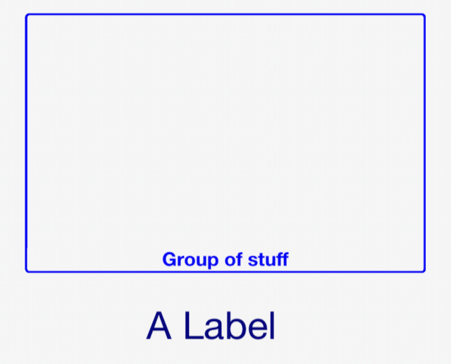

# DashIO

[**DashIO**](http://dashio.io) - a python library to connect and display widgets on the **DashIO** app.

## Beta Testers

We are currently looking for beta testers for our products. If you are interested in using and testing our app and a free DashIO account, please contact us at info@dashio.io

## Getting Started

See <https://github.com/dashio-connect/python-dashio>

```bash
cd Examples
python3 iot_monitor.py -s dash.dashio.io -p 8883 -u user -w password -c`hostname`
```

Will create a graph of network traffic with a connection_id of your hostname. The control and data topics are hostname_data and hostname_control.

## Requirements

* python3.6 and above
* paho-mqtt
* pyzmq
* python-dateutil
* zeroconf
* shortuuid

## Install

`pip3 install dashio`

Or

```sh
git clone git@github.com/dashio-connect/python-dashio
cd python-dashio
pip3 install .
```

## Guide

This guide covers the **DashIO** python library. For information on the [***DashIO***](https://dashio.io/dashboard) phone app please visit the website.

### Basics

So what is **DashIO**? It is a quick effortless way to connect your IoT device to your phone. It allows easy setup of controls such as Dials, Text Boxes, Maps, Graphs, Notifications..., from your Device. You can define the look and layout of the controls on your phone from your IoT device. There are three methods to connect to your phone tcp, mqtt, dash, and BLE. What's Dash then? Dash is a mqtt server with extra bits added in to allow you to send notifications, share your devices, and save your settings from your phone via the **DashIO** app.

Show me some code.

```python
import dashio
import random
import time

device = dashio.Device("aDeviceType", "aDeviceID", "aDeviceName")
tcp_con = dashio.TCPConnection()
tcp_con.add_device(device)
first_dial_control = dashio.Dial("FirstDial")
device.add_control(first_dial_control)

while True:
    first_dial_control.dial_value = random.random() * 100
    time.sleep(5)
```

This is about the fewest lines of code to get talking to the app. There is a lot happening under the hood to make this work. After the import we create a device with three attributes. These attributes describe the device to the app and allow you to distinguish one of your devices from another. The next two lines create a TCP connection and then add the device to the connection. The connection will be created with the default setting of port 5000 and will also advertise the service using zeroconf, also known as bonjour. This allows the **DashIO** app to find your device. After that we create a dial add it to the device and then every five seconds send a randomly generated dial value to the DashIO app.

Though this device is discoverable by the app it would be nice to have the DashIO app automatically setup a new DeviceView and place your control on the new DeviceView. To do that we need to add a few more lines of code:

```python
import dashio
import random
import time

device = dashio.Device("aDeviceType", "aDeviceID", "aDeviceName")
tcp_con = dashio.TCPConnection()
tcp_con.add_device(device)
first_dial_control = dashio.Dial("FirstDial", control_position=dashio.ControlPosition(0.24, 0.36, 0.54, 0.26))
device.add_control(first_dial_control)

dv_dial = dashio.DeviceView("aDeviceViewID", "A Dial")
dv_dial.add_control(first_dial_control)
device.add_control(dv_dial)

while True:
    first_dial_control.dial_value = random.random() * 100
    time.sleep(5)
```

First we altered the instantiation of a Dial by including a control_position. This allows us to place the control at a set location. The added lines instantiated a DeviceView control, which we than added the dial control. Finally we added the DeviceView to the device.

The next piece of the puzzle to consider is how do we get data from the DashIO app? Lets add a Knob and connect it to the Dial:

```python
import dashio
import time

device = dashio.Device("aDeviceType", "aDeviceID", "aDeviceName")
tcp_con = dashio.TCPConnection()
tcp_con.add_device(device)
first_dial_control = dashio.Dial("FirstDial", control_position=dashio.ControlPosition(0.24, 0.36, 0.54, 0.26))
device.add_control(first_dial_control)

dv = dashio.DeviceView("aDeviceViewID", "A Dial")
dv.add_control(first_dial_control)
device.add_control(dv)

def knob_event_handler(msg):
    first_dial_control.dial_value = float(msg[3])

aknob = dashio.Knob("aKNB", control_position=dashio.ControlPosition(0.24, 0.14, 0.54, 0.26))
aknob.message_rx_event += knob_event_handler
dv.add_control(aknob)
device.add_control(aknob)

while True:
    time.sleep(1)
```

First we added a function that sets the dial value. Next we added a Knob control and added our new function to be called when it receives data from the DashIO app. We also add it to the DeviceView and to the device. Now when the knob in the DashIO app is moved the dial is set to the same value.

### Using the Config64

The **DashIO** app can generate a CFG64 text string that defines the controls, the controls layout, and device parameters for the Device. The CFG64 string can be used in a number of ways. If we run the example above and using the **DashIO** app to export a layout we can use the layout to setup the device and controls.

```python
import dashio
import time

cfg64 = "pVNdr5pAEP0rN/tMjHCrbXnjQ60RxQD1Nmn6wIVVN8IuXZar1vjfOwuLeNWmTfo2OztzZnLmnBPybA+Z339oaLbwbYhOqBTHDCMT"\
"LfxgbnlIQwmjgrNs6kIyni1sSJWYpj7Njj4NcIbjEuoFr7CG8viATL3f11ARc0xF0+TiN5LgFcF7eGuI43QVZxU0fRxoSBBRz7Oe"\
"ZpS9wvcWk81WBLEgDJn9njFUNUtWEshRqLX9KPLncpEt288Jncux6zgrYYVjW3dB0D9oaAfYDssYh+4Ap9Cakjgbsyxj+7Ie3PbL"\
"fFtpyy01tCep2F7gBgB3uBtiQDYnsFz/DGyGnhs0vEajb5GKnCUyT6hgXCBzMBwASaSw0pTjsoRZ+mejpw8/9fSebvTRWUPuVEHM"\
"rWUTeP5EZUaLr000CZZfmshauU0Qek6kOh1PBe5q9fLuurYVTh15XMEzYG8MNw7JL/gxYK0NJylQUOUUFjMMSTNcs8m0l6ZVfinR"\
"b0Ryc285w2Y8xbzl9WVLBH4Kc7bD7f9uQ9OO9jjZqY+/tEQ8pmWtteQI3MtF3mN08nLhsKo1kkmbHR4NbP/ukCUrAagFmc/GVWlH"\
"nQ5KJUDEIs7lxPBnBd1IysGdWl5Nf8FxQspaxIDYHmM5Hd34bEx4KdTC/+UphfHAU7X+SXYhuHHFH512b6tnACkYoaK7q/ILaOMV"\
"8ysUbzSOHrv1X61VUSKkS9C1y6JO/XYULdpoouzijCfScGnNVIhFVQAAheNoe7ImmkiKZteOSqXl9SbAbxCez78B"

config_dict = dashio.decode_cfg64(cfg64)
device = dashio.Device("aDeviceType", "aDeviceID", "aDeviceName", config_dict)
tcp_con = dashio.TCPConnection()
tcp_con.add_device(device)

dv = dashio.get_control_from_config("aDeviceViewID", config_dict)
first_dial_control = dashio.get_control_from_config("FirstDial", config_dict)
aknob = dashio.get_control_from_config("aKNB", config_dict)

dv.add_control(first_dial_control)
dv.add_control(aknob)
device.add_control(first_dial_control)
device.add_control(dv)
device.add_control(aknob)

def knob_event_handler(msg):
    aknob.knob_dial_value = float(msg[3])
    first_dial_control.dial_value = float(msg[3])

aknob.add_receive_message_callback(knob_event_handler)

while True:
    time.sleep(1)
```

We've added the cfg64 string. Then decoded it with *dashio.decode_cfg64(cfg64)*. This function returns a dictionary that we can pass into *dashio.get_control_from_config(control_id, dict)* to instantiate a control object. [See Helper Functions](#helper-functions) for tools to use the CFG64 txt generated by exporting a layout from the **DashIO** app.

## DashIO Library Documentation

### Device

A Device is a collection of [Controls](#controls) and [DeviceViews](#deviceview) that represent an IoT device. The Device provides attributes and methods to communicate to a **DashIO** app.  

#### Device Attributes

* *device_type : str.* The type of device (e.g. TempSensor, GPS...). If you have lots of devices that do the same thing keep this constant across your devices.
* *device_id : str.* A unique identifier for this particular device.
* *device_name : str.* The name for this device (E.g. GlassHouse, MothersZimmerFrame...).
* *cfg_dict : dict.* Setup dict to setup and cfgRev, defaults None. [See Helper Functions](#helper-functions) for tools to use the CFG64 txt generated by exporting a layout from the **DashIO** app.

#### Device Methods

* *add_control(iot_control).* Add a control to the device.
* *use_cfg64().* Generate a CFG64 formated CFG message.
* *use_cfg().* Generate JSON formated CFG messages.
* *close().* Close the device.

#### Device Callback Methods

These callbacks are used to setup and configure connections by the **DashIO** app. Setting these callbacks advertises to the **DashIO** app that the connection can be modified.

* *set_wifi_callback(callback):* Set a callback function that is called when the DashIO app provides wifi provisioning information. The callback must return a Boolean indicating success.
* *unset_wifi_callback():* Clears the wifi callback.
* *set_dashio_callback(callback):* Set a callback function that is called when the DashIO app provides Dash server provisioning information.
* *unset_dashio_callback():* Clears the set Dash callback.
* *set_name_callback(callback):* Set a callback function that is called when the DashIO app provides Name provisioning information.
* *unset_name_callback():* Clears the set Name callback.
* *set_tcp_callback(callback):* Set a callback function that is called when the DashIO app provides TCP provisioning information.
* *unset_tcp_callback():* Clears the set TCP callback.
* *set_mqtt_callback(callback):* Set a callback function that is called when the DashIO app provides MQTT provisioning information.
* *unset_mqtt_callback():* Clears the set MQTT callback.

### Controls

Controls are objects that represent actions and widgets in the DashIO application. All controls have a ControlID, Title, and TitlePosition. The ControlID should be a string that can uniquely identifiy that control per device. The control Title is text that is displayed on **DashIO** with the Contol. The TitlePosition can be either `TitlePosition.TOP`, `TitlePosition.BOTTOM`, or `TitlePosition.NONE`. Controls that are displayed have a `dashio.ControlPosition` that is composed of four size and position variables: x_position_ratio, y_position_ratio, width_ratio, height_ratio. The first two are position ratios that place the top left corner of the widget on the DeviceView. The last two are ratios that govern the size of the widget. The ratios are propertional to the size of the screen with the full size of the screen representing 1.0. All controls have a callback that is used to return messages from the **DashIO** app. Controls on the **DashIO** app can have a graphical duplicate that may have a different set of *Config* attributes. This is achieved by adding that controls ControlControl with add_config_columnar(ControlControl).

Controls have two main types of attributes.

1) *Config Attributes*. These attributes define the look and placement of the control. They are used to generate the config information sent to the **DashIO** app when it issues a CFG command to the device, these are set in *init*.

2) *Messaging Atttributes*. Setting these attributes send messages to the **DashIO** app controlling the visable appearance of the control.

When controls are instantiated they create a ControlControl to add to its layout. More layouts can be added by creating a ControlConfig for that control and adding it with add_config_columnar(ControlConfig) or add_config_full_page(ControlConfig). This allows you to have two layouts - a columnar layout for phones and another for tablets. If you use a add_config_full_page layout then you will need to set the number of columns it uses with set_no_culumns_full_page().

#### DeviceView

A DeviceView provides a control that descibes appearance and style of the group of controls that are displayed on this DeviceView by the iotdashboard app.

##### DeviceView Attributes

All of these attributes are config attributes.

* *control_id : str.* An unique control identity string. The control identity string must be a unique string for each control per device. Each control inherits the DeviceViews Control settings.
* *title : str.* The controls title.
* *style : DeviceViewStyle.* The style of the DeviceView.
* *icon : Icon.* The Icon representing the DeviceView.
* *color : Color.* The color of the DeviceView.
* *share_column : Booloan.* If there is space can another DeviceView us it.
* *num_columns : int.* Number of columns for DeviceView.
* *control_title_box_color : Color.* Title box color for controls.
* *control_title_box_transparency : int.* Title box transparency for controls.
* *num_grid_columns : int.* The num of grid columns on the edit view.
* *num_grid_rows : int.* The num of grid rows on the edit view.

##### DeviceView Methods

* *add_control(Control) :* Add a control to the device view
* *from_cfg_dict(Dict) :* Instantiate a DeviceView as defined from the dictionary. [See Helper Functions](#helper-functions) for tools to use the CFG64 txt generated by exporting a layout from the **DashIO** app.

#### Alarm

```python
alarm = dashio.Alarm("alarm1_ID")
alarm.send("Alarm Header", "Alarm Body")
```

An alarm sends a notification throught the dashio mqtt server to registered phones. The ability to send alarms to specific phones, and the notification sound can be configured through the **DashIO** app. Alarms are only available if you have an account registered on the **DashIO** server and you send the the alarm through a dash connection.

##### Alarm Config Attributes

* *control_id : str.* An unique control identity string. The control identity string must be a unique string for each control per device

##### Alarm Methods

* *send(self, header: str, body: str).* Sends an alarm with *header* and *body*.

#### Audio Visual Display


An Audio Visual display allows the IoT Device to send a URL to the DashIO app to play or display
the contents of the URL. The URL may be a video or audio stream or an image.

##### Audio Visual Display Config Attributes

* *control_id : str.* An unique control identity string. The control identity string must be a unique string for each control per device
* *title : str, optional.* Title of the control, by default None
* *control_position : ControlPosition, optional.* The position of the control on a DeviceView, by default None
* *title_position : TitlePosition, optional.* Position of the title when displayed on the iotdashboard app, by default None

##### Audio Visual Display Message Attributes

* *url : str.* The url of the media to play.

#### Button

A Button allow the user to send a simple action, informing the IoT device that the button has been pressed. The button state (on or off color) is not changed by tapping the button. After the IoT device receives a message containing the action, it sends a message back to the control in the dashboard to set the button state.

A Button control behaves as both as a momentary push button for user input and as a status indicator to provide feedback from the IoT device.

The control can change the button icon and text of the control on the **DashIO** app.


```python
button1 = Button("button1_id", "Button Title")
button1.state = ButtonState.ON
button1.send_button(ButtonState.ON, Icon.UP, "Going Up")
button1.send_button(ButtonState.OFF, Icon.DOWN, "Going Down")
```

##### Button Config Attributes

* *control_id : str*. A unique identity string. The identity string must be a unique string for each ButtonGroup per device.
* *title : str*. A short title for the button group.
* *title_position : TitlePosition*. Can be TitlePosition.BOTTOM, TitlePosition.TOP, TitlePosition.OFF.
* *button_enabled : boolean*. True allows the app to send button events. False disables button pushes.
* *off_color : Color*. Set the off color.
* *on_color : Color*. Set the on color.
* *control_position : ControlPosition*. Set the size and position of the button on a DeviceView.

##### Button Messaging Attributes

When these attributes are set the button control will transmit the new value to connected **DashIO** apps.

* *text : str*. The text that appears on the ButtonGroup.
* *icon_name : Icon*. Set the icon for the button.
* *btn_state : ButtonState.* Set the state of the button.

##### Button Methods

* *send_button(btn_state: ButtonState, btn_icon: Icon, text: str) :* Updates the button state, button icon and text
* *from_cfg_dict(cfg_dict: dict):*  Instantiate a Button as defined from the dictionary. [See Helper Functions](#helper-functions) for tools to use the CFG64 txt generated by exporting a layout from the **DashIO** app.

##### Button Callbacks

* *message_rx_event(msg: list):* Call callback with msg from **DashIO** app. The msg is a list formed by splitting the message from the **DashIO** app on the tab character.

#### Button Group

A ButtonGroup control is used to present a popup grid or table of Button controls. The Button Group does not receive or send messages directly, but presents Button controls that send and receive messages.


##### Button Group Config Attributes

* *control_id : str.* A unique identity string. The identity string must be a unique string for each ButtonGroup per device
* *title: str.* A short title for the button group
* *text : str.* The text that appears on the ButtonGroup

##### Button Group Methods

* *add_button(Button):* Add a button to the ButtonGroup
* *from_cfg_dict(cls, cfg_dict: dict):*  Instantiate a ButtonGroup as defined from the dictionary. [See Helper Functions](#helper-functions) for tools to use the CFG64 txt generated by exporting a layout from the **DashIO** app.

#### Color Picker

A ColorPicker control is used to select a colour to send to the IoT device. The Colour Picker may
be shown as either a spectrum or as a colour wheel and brightness slider.

##### Color Picker Config Attributes

* *control_id : str.* An unique control identity string. The control identity string must be a unique string for each control per device.
* *title : str, optional*. Title of the control, by default None.
* *control_position : ControlPosition, optional.* The position of the control on a DeviceView, by default None.
* *title_position : TitlePosition, optional.* Position of the title when displayed on the iotdashboard app, by default None
* *picker_style: ColorPickerStyle, optional.* The style of color picker to use.
* *send_only_on_release: Boolean.* Send only on release, by default True

##### Color Picker Message Attributes

* *color_value : str.* Send the color. The color_value must be in #rrggbb format.

##### Color Picker Methods

* *send_color_rgb(red: int, green: int, blue: int).* Format the red, green, blue values as #RRGGBB and send to any connected **DashIO** apps.
* *color_to_rgb(color_value: str).* Return a tuple of RED, GREEN, BLUE integers from the given string in #RRGGBB format.
* *from_cfg_dict(cls, cfg_dict: dict):*  Instantiate a ColorPicker as defined from the dictionary. [See Helper Functions](#helper-functions) for tools to use the CFG64 txt generated by exporting a layout from the **DashIO** app.

##### Color Picker Callbacks

* *message_rx_event(msg: list):* Call callback with msg from **DashIO** app. The msg is a list formed by splitting the message from the **DashIO** app on the tab character.

#### Direction

A Direction display is used to graphically present a decimal direction value from 0 to 360 degrees. The Direction display receives messages from the IoT device to set the direction indicator position.


##### Direction Config Attributes

* *control_id : str.* An unique control identity string. The control identity string must be a unique string for each control per device.
* *title : str, optional.* Title of the control, by default "A Control".
* *control_position : ControlPosition, optional* The position of the control on a DeviceView, by default None
* *title_position : TitlePosition, optional.* Position of the title when displayed on the iotdashboard app, by default None.
* *\style : DirectionStyle, optional.* The Direction style to display, by default DirectionStyle.DEG.
* *pointer_color : Color, optional.* Color of the pointer, by default Color.GREEN.
* *units : str, optional.* Units to be displayed with the value, by default "".
* *precision : [type], optional.* Precision of the value displayed, by default Precision.OFF
* *calibration_angle : int, optional* Calibration angle offset, by default 0.

##### Direction Message Attributes

* *direction_value : float.* The direction to send to the **DashIO** app.
* *direction_text : str.* Text to be displayed on the direction control.

##### Direction Methods

* *from_cfg_dict(cls, cfg_dict: dict):*  Instantiate a Direction as defined from the dictionary. [See Helper Functions](#helper-functions) for tools to use the CFG64 txt generated by exporting a layout from the **DashIO** app.

##### Direction Callbacks

* *message_rx_event(msg: list):* Call callback with msg from **DashIO** app. The msg is a list formed by splitting the message from the **DashIO** app on the tab character.

#### Dial

A Dial display is used to present a numerical value in a graphical circular dial. The Dial display receives messages from the IoT device to set the dial position.


##### Dial Config Attributes

* *control_id : str.* An unique control identity string. The control identity string must be a unique string for each control per device.
* *title : str, optional.* Title of the control, by default None.
* *control_position : ControlPosition, optional.* The position of the control on a DeviceView, by default None.
* *title_position : TitlePosition, optional.* Position of the title when displayed on the iotdashboard app, by default None.
* *dial_min : float, optional.* Minimum dial position, by default 0.0.
* *dial_max : float, optional.* Maximum dial position, by default 100.0.
* *red_value : float, optional.* Position for red part of dial, by default 75.0.
* *dial_fill_color : Color, optional.* Dial fill color, by default Color.RED.
* *pointer_color : Color, optional.* Pointer color, by default Color.BLUE.
* *number_position : DialNumberPosition, optional.* Position of the number on the dial, by default DialNumberPosition.LEFT.
* *show_min_max : bool, optional.* True to show min max, by default False.
* *style : DialStyle, optional.* Dial style, by default DialStyle.PIE.
* *precision : Precision, optional.* Precision of the displayed number, by default Precision.OFF.
* *units : str, optional.* Units of the dial position, by default "".

##### Dial Message Attributes

* *dial_value : float.* The value to display on a dial.

##### Dial Methods

* *from_cfg_dict(cls, cfg_dict: dict):*  Instantiate a Dial as defined from the dictionary. [See Helper Functions](#helper-functions) for tools to use the CFG64 txt generated by exporting a layout from the **DashIO** app.

##### Dial Callbacks

* *message_rx_event(msg: list):* Call callback with msg from **DashIO** app. The msg is a list formed by splitting the message from the **DashIO** app on the tab character.

#### Event Log

An Event Log display is used to present time stamped events or alarms from  IoT devices. The most recent event is shown on the control and a scrollable list of events is presented when the Event Log is tapped by the user.

Each event contains the time of the event, the color to display the event and the text to display.

Multiple IoT devices can be shown on a single Event Log control.

##### Event Data

An EventData object is a single event used by the EventLog.

###### Attributes

* *lines : str.* Max 25 lines long. Each line is seperated by '\n'
* *color : Color, optional.* The color to display this data point on the iotdashboard app, by default Color.WHITE

##### Event Log Config Attributes

* *control_id : str.* A unique identifier for this control
* *title : str, optional.*  The title for this control will be displayed on the iotdashboard app, by default "An Event Log".
* *title_position : TitlePosition, optional.* The position of the title, by default TitlePosition.BOTTOM
* *control_position : ControlPosition, optional.* The position of the control on a DeviceView, by default None
* *max_log_entries : int, optional.* The EventLog usues a ring buffer for data entries this dfines the number entries before over wrting older entires, by default 100.

##### Event Log Methods

* *add_event_data(self, data: EventData):.* Add a data point to the log and send it to any connected iotdashboard app.
* *send_data(self).* Send the latest log entry to any connected iotdashboard app.
* *from_cfg_dict(cls, cfg_dict: dict):*  Instantiate an EventLog as defined from the dictionary. [See Helper Functions](#helper-functions) for tools to use the CFG64 txt generated by exporting a layout from the **DashIO** app.

#### Graph

A Graph display is used to present graphical data on the DashIO Dashboard, where the data is a series of vertical (Y) axis data. The data is evenly spaced on the horizontal (X) axis. The IoT device sends a message for each line in the graph. The data may be shown as lines, bars or peak values.

Each line can be independently added, deleted or changed by the IoT device. Multiple IoT devices can add lines to a single Graph control.


```python
import dashio
graph = dashio.Graph("graph1", "Graph")
gl_line = dashio.GraphLine("Randon Data", dashio.GraphLineType.LINE, color=dashio.Color.BLUE)
data = np.random.normal(0, 20, 100)
gl_line.data = data.tolist()
graph.add_line("line_1", gl_line)
```

##### Graph Line

An GraphLine object represents a line for a Graph.

###### Graph Line Attributes

* *name : str.* The name of the line.
* *line_type : GraphLineType.* The format of the line: LINE, BAR, SEGBAR, PEAKBAR, DEL. Sending DEL removes the line from the graph.
* *color : Color*. The color of the GraphLine.
* *data. : list.* The list containing data values to display on the Graph.

##### Graph Config Attributes

* *control_id : str.* A unique identifier for this control.
* *title : str, optional.* The title for this control will be displayed on the iotdashboard app, by default "A Graph".
* *title_position : TitlePosition, optional.* The position of the title, by default TitlePosition.BOTTOM.
* *x_axis_label : str, optional.* The label for the X axis, by default "".
* *x_axis_min : float, optional.* Min value for the X axis, by default 0.0.
* *x_axis_max : float, optional.* Max value for the X axis, by default 100.0.
* *x_axis_num_bars : int, optional.* Number of bars on the X axis, by default 5.
* *x_axis_labels_style : GraphXAxisLabelsStyle, optional.* The style for the X axis, by default GraphXAxisLabelsStyle.ON.
* *y_axis_label : str, optional.* The label for the Y axis,, by default "".
* *y_axis_min : float, optional.* Min value for the Y axis, by default 0.0.
* *y_axis_max : float, optional.* Max value for the Y axis, by default 100.0.
* *y_axis_num_bars : int, optional.* Number of bars on the Y axis, by default 5.
* *control_position : ControlPosition, optional.* The position of the control on a DeviceView, by default None.

##### Graph Methods

* *add_line(self, line_id: str, gline: GraphLine).* Add a line to the graph.
  * *line_id: str.* An unique identifier for this Graph.
  * *gline: GraphLine.* The Line to add to the graph.
* *send_graph().* Sends the graph data to IoT dashboard.
* *from_cfg_dict(cls, cfg_dict: dict):*  Instantiate an EventLog as defined from the dictionary. [See Helper Functions](#helper-functions) for tools to use the CFG64 txt generated by exporting a layout from the **DashIO** app.

#### Knob

A Knob allow the user to send numerical values to the IoT device when the user drags the knob to a new position. A Knob control contains a user adjustable knob surrounded by a simple dial indicator. The dial can be controlled independently of the knob or can be used to provide feedback to the user from the IoT Device.

The IoT device may send messages to update both the dial and knob positions.


##### Knob Config Attributes

* *control_id : str.* A unique identifier for this control.
* *title : str, optional.* The title for this control will be displayed on the iotdashboard app, by default "A Knob".
* *title_position : TitlePosition, optional.* The position of the title, by default TitlePosition.BOTTOM.
* *knob_style : KnobStyle, optional.* The Knob style, by default KnobStyle.NORMAL.
* *dial_min : float, optional.* Minimum dial value, by default 0.0.
* *dial_max : float, optional.* Maximum dial value, by default 100.0.
* *red_value : float, optional.* The value where the red starts, by default 75.0.
* *show_min_max : bool, optional.* Whether to show the min amd max values, by default False.
* *send_only_on_release : bool, optional.* Have the **DashIO** app send values either on release or during movement, by default True.
* *dial_follows_knob : bool, optional.* Have the DashIO app adjust the dial to match the knob value, by default False.
* *dial_color : Color, optional.* Color of the Dial, by default Color.BLUE.
* *knob_color : Color, optional.* Color of the Knob, by default Color.RED.
* *control_position : ControlPosition, optional.* The position of the control on a DeviceView, by default None.

##### Knob Message Attributes

* *knob_value : float.* Sends the value of the knob.
* *knob_dial_value : float.* Sends the value for the dial on the knob.

##### Knob Methods

* *from_cfg_dict(cls, cfg_dict: dict):*  Instantiate a Knob as defined from the dictionary. [See Helper Functions](#helper-functions) for tools to use the CFG64 txt generated by exporting a layout from the **DashIO** app.

##### Knob Callbacks

* *message_rx_event(msg: list):* Call callback with msg from **DashIO** app. The msg is a list formed by splitting the message from the **DashIO** app on the tab character.

#### Label

A Label is a simple control to add structure to your layout on the dashboard. Labels do not transfer information with IoT devices.



##### Label Config Attributes

* *control_id : str.* An unique control identity string. The control identity string must be a unique string for each control per device.
* *title : str, optional.*  Title of the control, by default "A Label".
* *control_position : ControlPosition, optional.* The position of the control on a DeviceView, by default None
* *title_position : TitlePosition, optional.* Position of the title when displayed on the iotdashboard app, by default None.
* *color : Color, optional.* Color of the label, by default Color.WHITE.
* *style : LabelStyle, optional.* Style of label to be displayed, by default LabelStyle.BASIC

##### Label Methods

* *from_cfg_dict(cls, cfg_dict: dict):*  Instantiate a Label as defined from the dictionary. [See Helper Functions](#helper-functions) for tools to use the CFG64 txt generated by exporting a layout from the **DashIO** app.

#### Map

A Map display is used to plot positions on a map. The Map display receives messages from the IoT Device that contain latitude and longitude to mark the position. Additional data, such as speed and altitude may also be included and shown on the Map display.

Multiple IoT devices can be shown on a single Map.


#### Menu

A Menu control is used to present a popup table of user adjustable controls and is ideal for presenting a list of IoT device setup parameters. The Menu does not receive messages directly, but presents a list of other controls (sub-controls) that send and receive messages of their own.

Controls that can be included in a Menu control are Text Boxes, Sliders, Selectors and Buttons.


##### Menu Config Attributes

* *control_id : str.* An unique control identity string. The control identity string must be a unique string for each control per device.
* *title : str, optional.* Title of the control, by default "A Menu"
* *control_position : ControlPosition, optional.* The position of the control on a DeviceView, by default None.
* *title_position : TitlePosition, optional.* Position of the title when displayed on the iotdashboard app, by default None.
* *text : str, optional.* Menu text, by default "A Menu with Text".
* *icon : Icon, optional.* Menu icon, by default Icon.MENU.

##### Menu Methods

* *add_control(control).* Add a control to the menu.
* *from_cfg_dict(cls, cfg_dict: dict):*  Instantiate a Menu as defined from the dictionary. [See Helper Functions](#helper-functions) for tools to use the CFG64 txt generated by exporting a layout from the **DashIO** app.

#### Selector

A Selector control is used to present a popup list of options that the user can select from. When a Selector is tapped, the DashIO Dashboard presents the list of text options to the user to make their selection from. The user can tap on an option to select is and the index of the selected option will be sent to the IoT device.

Feedback to the user of the dashboard is achieved when the IoT device responds to the selection message. The dashboard updates the Selector control check box with this value.


##### Selector Config Attributes

* *control_id : str.* An unique control identity string. The control identity string must be a unique string for each control per device.
* *title : str, optional.* Title of the control, by default "A Selector".
* *control_position : ControlPosition, optional.* The position of the control on a DeviceView, by default None.
* *title_position : TitlePosition, optional.* Position of the title when displayed on the iotdashboard app, by default None.

##### Selector Message Attributes

* *position : int.* Sends the position index of the selected Text.

##### Selector Methods

* *add_selection(text: str):.* Add the text to the selection list.
* *set_selected(selected_text: str).* Set the selector to the selected text
* *from_cfg_dict(cls, cfg_dict: dict):*  Instantiate a Menu as defined from the dictionary. [See Helper Functions](#helper-functions) for tools to use the CFG64 txt generated by exporting a layout from the **DashIO** app.

##### Selector Callbacks

* *message_rx_event(msg: list):* Call callback with msg from **DashIO** app. The msg is a list formed by splitting the message from the **DashIO** app on the tab character.

#### Slider

A Sliders allow the user to send a numerical values to the IoT device when the user drags the slider to a new position. The slider also includes bar graph that can be set by the IoT device. The bar graphs can be controlled independently of the slider or can be used to provide feedback to the user from the IoT Device.

The IoT device may send messages to update both the bar graph and the slider knob positions. The bar graph may set to have two bars.

The knob of the slider may be disabled so that the slider becomes a simple bar graph indicator.


##### Slider Config Attributes

* *control_id : str.* An unique control identity string. The control identity string must be a unique string for each control per device.
* *title : str, optional.* Title of the control, by default "A Single SLider".
* *control_position : ControlPosition, optional.* The position of the control on a DeviceView, by default None
* *title_position : TitlePosition, optional.* Position of the title when displayed on the iotdashboard app, by default None.
* *bar_min : float, optional.* The min bar value, by default 0.0.
* *bar_max : float, optional.* The max bar vale, by default 1000.0
* *red_value : int, optional.* Bar red value, by default 750
* *show_min_max : bool, optional.* show min max, by default False.
* *slider_enabled : bool, optional.* Enable slider, by default True.
* *send_only_on_release : bool, optional.* Send only on release, by default True.
* *bar_follows_slider : bool, optional.* Whether the bar follows slider, by default False.
* *bar_color : Color, optional.* The bar color, by default Color.BLUE.
* *knob_color : Color, optional.* The knob color, by default Color.RED.
* *bar_style : SliderBarStyle, optional.* The bar style, by default SliderBarStyle.SEGMENTED

##### Slider Message Attributes

* *bar1_value : float.* Sends the value of bar1.
* *bar2_value : float.* Sends the value of bar2. If this value is not set then only one bar is shown on the **DashIO** app.
* slider_value : float.* Sends the slider value.

##### Slider Methods

* *from_cfg_dict(cls, cfg_dict: dict):*  Instantiate a Slider as defined from the dictionary. [See Helper Functions](#helper-functions) for tools to use the CFG64 txt generated by exporting a layout from the **DashIO** app.

##### Slider Callbacks

* *message_rx_event(msg: list):* Call callback with msg from **DashIO** app. The msg is a list formed by splitting the message from the **DashIO** app on the tab character.

#### Text Box

A Text Box control receives simple line text messages from the IoT device to display on the DashIO Dashboard. The text may optionally be plain text, reformatted as a number or, when the text is ISO8601 date/time, it may be formatted to a date/time that is easy to read.

The Text Box may also allow the user to input text. Touching the control will present the user with a keyboard where the user can enter text. When the Send button on the keyboard is pressed, the message will be sent to the IoT device.


##### Text Box Config Attributes

* *control_id : str.* An unique control identity string. The control identity string must be a unique string for each control per device.
* *title : str, optional.* Title of the control, by default None.
* *control_position : ControlPosition, optional.* The position of the control on a DeviceView, by default None.
* *title_position : TitlePosition, optional.* Position of the title when displayed on the iotdashboard app, by default None.
* *text : str, optional.* Text for the textbox, by default "".
* *text_align : TextAlignment, optional.* Text alaignment, by default TextAlignment.LEFT.
* *text_format : TextFormat, optional.* Format of the text, by default TextFormat.NONE.
* *units : str, optional.* Units, by default "".
* *precision : Precision, optional.* precision, by default Precision.OFF
* *keyboard_type : Keyboard, optional.* Keyboard type for the textbox, by default Keyboard.ALL.
* *close_keyboard_on_send : bool, optional.* Set to True to close keyboard on close, by default True.

##### Text Box Message Attributes

* *text : str.* Sends text to the **DashIO** app.

##### Text Box Methods

* *from_cfg_dict(cls, cfg_dict: dict):*  Instantiate a Menu as defined from the dictionary. [See Helper Functions](#helper-functions) for tools to use the CFG64 txt generated by exporting a layout from the **DashIO** app.

##### Text Box Callbacks

* *message_rx_event(msg: list):* Call callback with msg from **DashIO** app. The msg is a list formed by splitting the message from the **DashIO** app on the tab character.

#### Time Graph

A Time Graph display is used to present time-series graphical data on the DashIO Dashboard, where the data is a series of points containing the time on the horizontal axis and other data on the vertical axis. The IoT device sends messages for each line in the graph. Each message contains one or more data points and the DashIO Dashboard appends the incoming data to create a data series that can be presented, panned and zoomed by the user. The data may be shown as lines, bars or blocked areas.

Each line can be independently added, deleted or changed by the IoT device. Multiple IoT devices can add lines to a single Time Graph control.

Graph data is stored in the dashboard.


##### Data Point

A DataPoint is a time stamped data point for a Time Graph Line.

###### Data Point Attributes

* *data.* A data point can be an int, float, or boolean, or string representing a number. The time that the DataPoint is made is recorded with the data point.

##### Time Graph Line

A TimeGraphLine for a TimeGraph control.

###### Time Graph Line Attributes

* *name : str, optional.* The name of the line, by default "".
* *line_type : TimeGraphLineType, optional.* Which line type to use, by default TimeGraphLineType.LINE.
* *color : Color, optional.* The color of the line, by default Color.BLACK.
* *max_data_points : int, optional.* The data is stored in a ring buffer this sets the ring buffer size, by default 60
* *break_data : bool, optional.* If true draws the line with breaks between missing data, by default False

###### Time Graph Line Methods

* *add_data_point(data_point : DataPoint):.* Adds a DataPoint to the TimeGraphLine.

##### Time Graph Config Attributes

* *control_id : str.* An unique control identity string. The control identity string must be a unique string for each control per device.
* *title : str, optional.* Title of the control, by default "A TimeGraph"
* *control_position : ControlPosition, optional.* The position of the control on a DeviceView, by default None.
* *title_position : TitlePosition, optional.* Position of the title when displayed on the iotdashboard app, by default None.
* *y_axis_label : str, optional.* Label for the Y axis, by default "Y axis".
* *y_axis_min.* Min value for the Y axis, by default 0.0.
* *y_axis_max : float, optional.* Max value for the Y axis, by default 100.0.
* *y_axis_num_bars : int, optional.* The number of bars to display on the graph, by default 5.

##### Time Graph Methods

* *add_line(line_id: str, gline: TimeGraphLine).* Adds a TimeGraphLine to the TimeGraph.
  * line_id : str. A unique to the graph line id
  * gline : TimeGraphLine. The line to add
* *send_data():.* Sends the latest data to the **DashIO** app.
* *from_cfg_dict(cls, cfg_dict: dict):*  Instantiate a Menu as defined from the dictionary. [See Helper Functions](#helper-functions) for tools to use the CFG64 txt generated by exporting a layout from the **DashIO** app.

### Connections

To enable a device to communicate to the **DashIO** app a connection is required. A device can have multiple connections and a connection can have multiple devices.

#### DashConnection

The DashConnection sets up a connection to the **DashIO** app via the **DashIO** mqtt server. The **DashIO** server has support for:

1. sending notifications
2. data storage for TimeGraphs, EventLogs, and Maps.
3. Sharing devices with other users.

##### DashConnection Attributes

* *username : str* username for the dash server connection.
* *password : str* password for the dash server connection.
* *host : str, optional.* The server name of the dash server host. Optional defaults to "dash.dashio.io"
* *port :int, optional.* Port number to connect to. Defaults to 8883,
* *use_ssl : bool, optional.* Whether to use ssl for the connection or not. default: True.

##### DashConnection Methods

* *add_device(device: Device).* Adds a device to the connection.
* *close().* Closes the connection.
* *set_connection(username: str, password)* Changes the connection to the DashIO server.
  * *username : str.* username for the server.
  * *password : str.* password for the server.

#### TCPConnection

The TCPConnection sets up a connection to the **DashIO** app within a local area network.

##### TCPConnection Attributes

* *ip_address : str, optional.* IP Address to use. Defaults to "\*". Only set this if you know which IP address to connect to on the local machine. The "\*" option will use all available addresses.
* *port : int, optional.* Port to use. Defaults to 5650.
* *use_zero_conf : bool, optional.* Use mDNS to advertise the connection. Defaults to True. This allows the **DashIO** app to find the connection on the network.

##### TCPConnection Methods

* *add_device(device: Device).* Adds a device to the connection.
* *close().* Closes the connection.

#### MQTTConnection

The MQTTConnection sets up a connection to the **DashIO** app via a MQTT server.

##### MQTTConnection Attributes

* *host : str.* The server name of the mqtt host.
* *port :int.* Port number to connect to.
* *username : str* username for the mqtt connection.
* *password : str* password for the mqtt connection.
* *use_ssl : bool.* Whether to use ssl for the connection or not. (default: {False})

##### MQTTConnection Methods

* *add_device(device: Device).* Adds a device to the connection.
* *close().* Closes the connection.

#### BLEConnection

The BLEConnection is only supported on Linux systems and requires bluez and dbus to be installed. It has been developed with the RaspberryPi Zero W in mind.

##### BLEConnection Attributes

* *ble_uuid : str, optional.* The UUID used by the BLE connection, if None a UUID is generated.

##### BLEConnection Methods

* *add_device(device: Device).* Adds a device to the connection.
* *close().* Closes the connection.

The steps to get a Pi Zero to become a Device Server

Install bluez and bluetooth:

```bash
sudo apt-get install bluetooth bluez
```

Edit:

```bash
sudo nano /lib/systemd/system/bluetooth.service
```

Replace:

```bash
ExecStart=/usr/lib/bluetooth/bluetoothd

```

With:

```bash
ExecStart=/usr/lib/bluetooth/bluetoothd --noplugin=sap
```

Edit:

```bash
sudo nano /lib/systemd/system/bthelper@.service
```

Replace the [Service] segment with:

```bash
[Service]
Type=simple
ExecStartPre=/bin/sleep 2
ExecStart=/usr/bin/bthelper %I
ExecStartPost=sudo /etc/init.d/bluetooth restart
```

Edit:

```bash
sudo nano /etc/bluetooth/input.conf 
```

Set:

```bash
LEAutoSecurity=false
```

To use the BLEConnection it has to be imported explicitly:

```python
from dashio.bleconnection import BLEConnection
```

### Helper Functions

#### **decode_cfg64(cfg: str) -> dict:**

Decodes and unzips a CFG64 text string generated by the **DashIO** app when it exports a layout. Returns a dictionary.

#### **encode_cfg64(cfg: dict) -> str:**

Encodes cfg dictionary into C64 string.

#### **get_control_from_config(control_id: str, cfg_dict: dict):**

Returns a control object instantiated from cfg_dict with the given control_id.

#### **get_control_dict_from_config(control_id: str, cfg_dict: dict) -> dict:**

Returns a control config dictionary from cfg_dict with the given control_id

#### **load_all_controls_from_config(device, cfg_dict) -> dict:**

Loads all the controls in cfg_dict into the given device and returns a dictionary of the control objects
